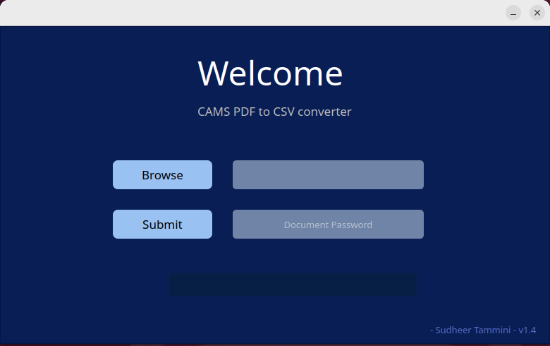

# Cams2csv
A simple piece of software that will extract CAMS Mutual fund (India) PDF statement data on to a CSV file.

I’ve built this tool for my own personal use so lot of love and passion involved.  It's a fully Open Source project and comes with GPL3 License. I have no intention of collecting your data, I respect your privacy as much as mine.

No malicious code what’s so ever, the code is hosted on GitHub so you can review yourself.    

At this stage, I’m supporting both Windows & Linux and the packages can be downloaded from the below links.

- [Windows 10/11](https://github.com/SudheerNotes/cams2csv/releases/download/v1.0/Cams2Csv_Windows10.11.zip)
- [Ubuntu 22.4 and Its derivatives](https://github.com/SudheerNotes/cams2csv/releases/download/v1.0/cams2csv_Ubuntu22.04.zip)

## How to use

The UI is very simple and self explanatory.

**Step 1:** Click on `Browse` button and select your CAMS PDF file.

**Step 2:** If your PDF statement is password protected then click on the `Password?` checkbox

**Step 3:** Enter your password and  hit `Submit` button - that's it.

In couple of minutes a CSV file will be saved in your `Downloads` folder. 

### Here is a simple UI of this tool

